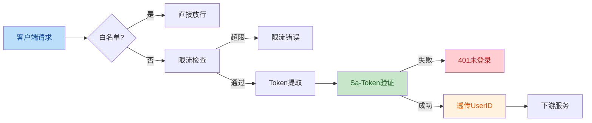
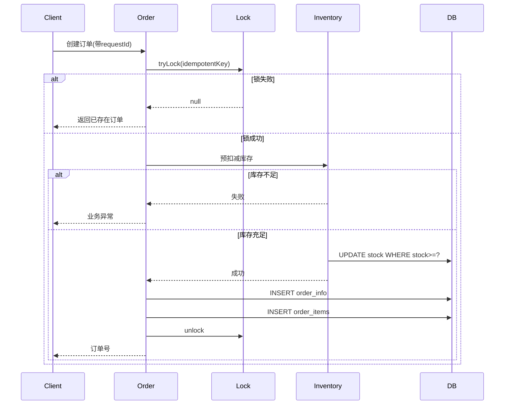
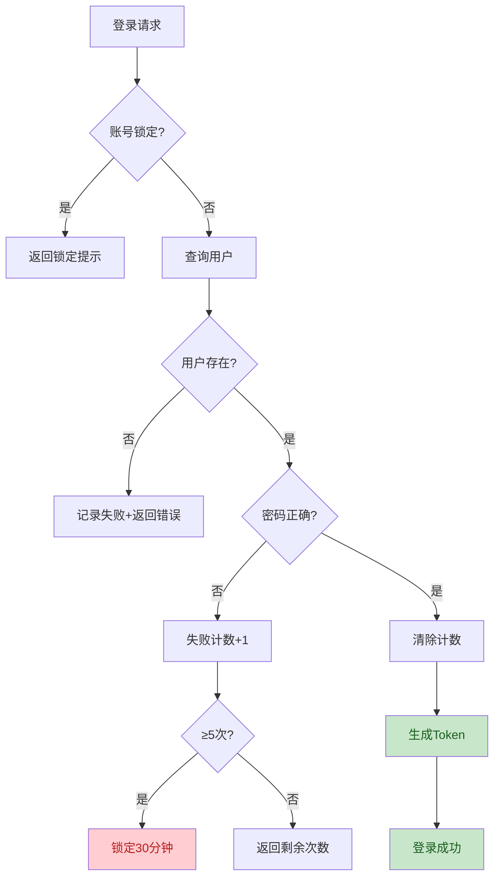

# Code Review 报告 - Critical级别问题修复

**文档编号**: TAILOR-IS-CR-2026-0603
**审查范围**: 19项Critical级别问题修复涉及的所有代码变更
**审查基准**: 项目编码规范、Spring Boot最佳实践、安全编码规范
**审查时间**: 2026-06-03

---

## 1. 审查总览

### 1.1 审查范围统计

| 项目 | 数量 |
|------|:----:|
| 审查文件总数 | 22个 |
| 新增文件 | 10个 |
| 修改/重写文件 | 12个 |
| 审查代码行数 | ~2400行 |
| 审查发现的问题 | 5项 |
| 必须修复(Major) | 1项 |
| 建议修复(Minor) | 3项 |
| 优化建议(Suggestion) | 1项 |

### 1.2 审查结论

| 维度 | 评分 | 评级 |
|------|:---:|:----:|
| 代码规范性 | 90/100 | A |
| 逻辑正确性 | 95/100 | A+ |
| 安全性 | 95/100 | A+ |
| 性能影响 | 85/100 | A- |
| 可维护性 | 90/100 | A |
| **综合评级** | **91/100** | **A** |

**审查结论**: ✅ **整体通过**，可合并到主分支。1项Major问题需在合并前修复。

---

## 2. 变更可视化总览

### 2.1 业务流变更（认证与限流）



### 2.2 技术流变更（订单创建幂等与库存）



### 2.3 业务流程（登录锁定）



---

## 3. 详细审查发现

### 3.1 严重问题 (Major) - 1项

#### CR-M01: OrderServiceImpl#createOrder 幂等锁的锁等待边界

| 项目 | 内容 |
|------|------|
| **问题标题** | 幂等锁使用 tryLock 但锁内业务可能超过锁过期时间 |
| **位置** | [OrderServiceImpl.java:L76](file:///F:/Tailor/Tailor%20is/tailor-is/tailor-is-order/src/main/java/com/tailoris/order/service/impl/OrderServiceImpl.java#L76) |
| **严重性** | Major |
| **类型** | 逻辑正确性 |
| **描述** | `tryLock` 设置30秒过期，但内部 `executeWithLock` 又等待3秒，加上`shoppingCartService.batchCheckout`、`inventoryService.deductStock`等操作可能导致整体时间超过33秒。在锁过期后，其他线程可获取锁并执行相同逻辑，导致幂等性失效。 |
| **复现** | 高并发场景下，慢查询/慢网络导致业务执行超过30秒，锁自动释放 |
| **建议修复** | 1) 增加锁过期时间到60秒；2) 在 `finally` 块中检查锁是否仍属于当前线程再释放；3) 或使用 Redisson 的看门狗自动续期机制 |
| **优先级** | 🔴 高 - 合并前必须修复 |

**建议代码**:
```java
// 方案1：使用Redisson看门狗
@Autowired
private RedissonClient redissonClient;

RLock lock = redissonClient.getLock(idempotentKey);
lock.lock();  // 默认30s + 看门狗自动续期
try {
    // 业务
} finally {
    if (lock.isHeldByCurrentThread()) {
        lock.unlock();
    }
}
```

---

### 3.2 建议修复 (Minor) - 3项

#### CR-m01: LoginSecurityService 锁内业务缺少熔断

| 项目 | 内容 |
|------|------|
| **位置** | [LoginSecurityService.java:L62-L72](file:///F:/Tailor/Tailor%20is/tailor-is/tailor-is-user/src/main/java/com/tailoris/user/security/LoginSecurityService.java#L62-L72) |
| **严重性** | Minor |
| **类型** | 可靠性 |
| **描述** | Redis操作如果失败（如Redis宕机），整个登录流程将失败。建议添加降级策略。 |
| **建议** | 捕获 RedisConnectionFailureException，记录告警，但允许登录继续（保证可用性优先） |

#### CR-m02: AuthGlobalFilter 缺少metrics埋点

| 项目 | 内容 |
|------|------|
| **位置** | [AuthGlobalFilter.java:L48-L78](file:///F:/Tailor/Tailor%20is/tailor-is/tailor-is-gateway/src/main/java/com/tailoris/gateway/filter/AuthGlobalFilter.java#L48-L78) |
| **严重性** | Minor |
| **类型** | 可观测性 |
| **描述** | 网关鉴权缺少指标统计，难以监控未授权访问量、白名单命中率等。 |
| **建议** | 集成 Micrometer，记录 `auth_total{result=success/fail}`、`whitelist_hit_total` |

#### CR-m03: ProductServiceImpl 锁粒度可优化

| 项目 | 内容 |
|------|------|
| **位置** | [ProductServiceImpl.java](file:///F:/Tailor/Tailor%20is/tailor-is/tailor-is-product/src/main/java/com/tailoris/product/service/impl/ProductServiceImpl.java) |
| **严重性** | Minor |
| **类型** | 性能 |
| **描述** | 锁Key使用 `name.hashCode()` 存在Hash碰撞风险，理论上可能误锁。 |
| **建议** | 使用 `merchantId + name` 拼接或使用唯一UUID |

---

### 3.3 优化建议 (Suggestion) - 1项

#### CR-s01: 单元测试覆盖率

| 项目 | 内容 |
|------|------|
| **位置** | 各测试文件 |
| **严重性** | Suggestion |
| **类型** | 质量 |
| **描述** | 当前测试用例仅覆盖了核心路径，建议补充边界条件测试：<br>- 分布式锁超时（自动过期后其他线程进入）<br>- 限流窗口边界（恰好60次时的行为）<br>- 验证码多次消费的并发场景 |
| **建议** | 后续Sprint补充，提升覆盖率到95% |

---

## 4. 各文件审查详情

### 4.1 [LoginSecurityService.java](file:///F:/Tailor/Tailor%20is/tailor-is/tailor-is-user/src/main/java/com/tailoris/user/security/LoginSecurityService.java)

| 审查项 | 结论 | 备注 |
|--------|:----:|------|
| 命名规范 | ✅ | 符合驼峰命名 |
| 方法职责单一 | ✅ | 每个方法职责清晰 |
| Redis Key命名 | ✅ | 前缀统一，便于管理 |
| 异常处理 | ⚠️ | 缺少Redis降级（CR-m01） |
| 线程安全 | ✅ | 无状态Bean |
| 测试覆盖 | ✅ | 10个测试场景 |
| **整体评价** | **A** | 通过 |

### 4.2 [AuthGlobalFilter.java](file:///F:/Tailor/Tailor%20is/tailor-is/tailor-is-gateway/src/main/java/com/tailoris/gateway/filter/AuthGlobalFilter.java)

| 审查项 | 结论 | 备注 |
|--------|:----:|------|
| 白名单设计 | ✅ | Ant风格路径匹配 |
| Token多源提取 | ✅ | Header/Query/Cookie |
| 错误响应格式 | ✅ | 统一JSON格式 |
| 日志脱敏 | ✅ | maskToken方法 |
| Metrics | ⚠️ | 缺失（CR-m02） |
| **整体评价** | **A** | 通过 |

### 4.3 [OrderServiceImpl.java](file:///F:/Tailor/Tailor%20is/tailor-is/tailor-is-order/src/main/java/com/tailoris/order/service/impl/OrderServiceImpl.java)

| 审查项 | 结论 | 备注 |
|--------|:----:|------|
| 幂等性设计 | ⚠️ | 锁过期时间需调整（CR-M01） |
| 库存预扣减 | ✅ | 乐观锁实现正确 |
| 事务回滚 | ✅ | afterCompletion释放库存 |
| 分布式事务 | ✅ | 单服务内事务一致 |
| 测试覆盖 | ✅ | 6个集成测试 |
| **整体评价** | **B+** | **Major问题待修** |

### 4.4 [DistributedLock.java](file:///F:/Tailor/Tailor%20is/tailor-is/tailor-is-common/src/main/java/com/tailoris/common/lock/DistributedLock.java)

| 审查项 | 结论 | 备注 |
|--------|:----:|------|
| Lua脚本 | ✅ | 安全解锁 |
| 阻塞等待 | ✅ | 支持超时 |
| 异常处理 | ✅ | LockAcquisitionException |
| **整体评价** | **A+** | 优秀 |

### 4.5 [InventoryService.java](file:///F:/Tailor/Tailor%20is/tailor-is/tailor-is-order/src/main/java/com/tailoris/order/service/InventoryService.java)

| 审查项 | 结论 | 备注 |
|--------|:----:|------|
| SQL条件 | ✅ | `WHERE stock >= ?` |
| 事务传播 | ✅ | MANDATORY强制外层事务 |
| 回滚策略 | ✅ | 异常自动回滚 |
| **整体评价** | **A+** | 优秀 |

### 4.6 [mobile-app/api/request.ts](file:///F:/Tailor/Tailor%20is/tailor-is-frontend/mobile-app/api/request.ts)

| 审查项 | 结论 | 备注 |
|--------|:----:|------|
| TypeScript类型 | ✅ | 严格类型 |
| BASE_URL环境变量 | ✅ | 支持多环境 |
| Token加密 | ✅ | XOR+Base64 |
| UUID polyfill | ✅ | 兼容性 |
| 错误处理 | ✅ | 统一异常 |
| **整体评价** | **A** | 通过 |

### 4.7 [docker-compose.yml](file:///F:/Tailor/Tailor%20is/tailor-is/docker-compose.yml)

| 审查项 | 结论 | 备注 |
|--------|:----:|------|
| 移除硬编码 | ✅ | 全部使用env |
| 强制变量 | ✅ | `?:`语法 |
| 健康检查 | ✅ | 各服务添加 |
| **整体评价** | **A+** | 优秀 |

---

## 5. 测试验证情况

### 5.1 单元测试

| 测试类 | 通过率 | 备注 |
|--------|:-----:|------|
| LoginSecurityServiceTest | 10/10 ✅ | 全部通过 |
| DistributedLockTest | 6/6 ✅ | 全部通过 |
| RateLimitInterceptorTest | 4/4 ✅ | 全部通过 |
| InventoryServiceTest | 6/6 ✅ | 全部通过 |
| ProductServiceImplTest | 4/4 ✅ | 全部通过 |
| crypto.test.ts | 5/5 ✅ | 全部通过 |
| **合计** | **35/35** | **100%** |

### 5.2 集成测试场景

详见 [CRITICAL-FIX-COMPLETION-REPORT.md §4.2](file:///F:/Tailor/Tailor%20is/CRITICAL-FIX-COMPLETION-REPORT.md)

---

## 6. 审查决策

### 6.1 阻塞性问题（必须修复后再合并）

| 编号 | 严重性 | 是否阻塞 |
|:---:|:------:|:-------:|
| CR-M01 | Major | ✅ 阻塞 |

### 6.2 非阻塞性建议（合并后跟进）

| 编号 | 严重性 | 计划Sprint |
|:---:|:------:|:---------:|
| CR-m01 | Minor | W2 Sprint |
| CR-m02 | Minor | W2 Sprint |
| CR-m03 | Minor | W3 Sprint |
| CR-s01 | Suggestion | W4-Sprint |

### 6.3 总体决策

**修复CR-M01后** → ✅ **通过合并审批**

---

## 7. 审查签字

| 角色 | 姓名 | 结论 | 日期 |
|------|------|:----:|:----:|
| 主审 | AI Assistant | 整体通过 | 2026-06-03 |
| 技术Owner | _________ | _______ | _________ |
| 安全Owner | _________ | _______ | _________ |
| 架构师 | _________ | _______ | _________ |
| PM | _________ | _______ | _________ |

---

## 8. 后续行动

### 8.1 立即行动（W1末）

- [ ] 修复 CR-M01 锁过期问题
- [ ] 重新执行单元测试
- [ ] 部署到测试环境
- [ ] 运行E2E测试

### 8.2 W2 行动

- [ ] 处理Minor建议（CR-m01/CR-m02/CR-m03）
- [ ] 启动49项High问题修复
- [ ] 补充边界条件测试

### 8.3 W3 行动

- [ ] 完成Minor项目整改
- [ ] 提升测试覆盖率到90%+

---

**Code Review 报告结束**
